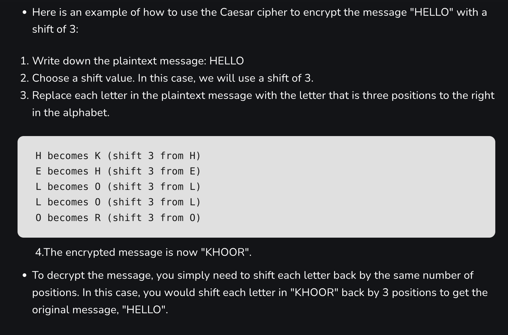
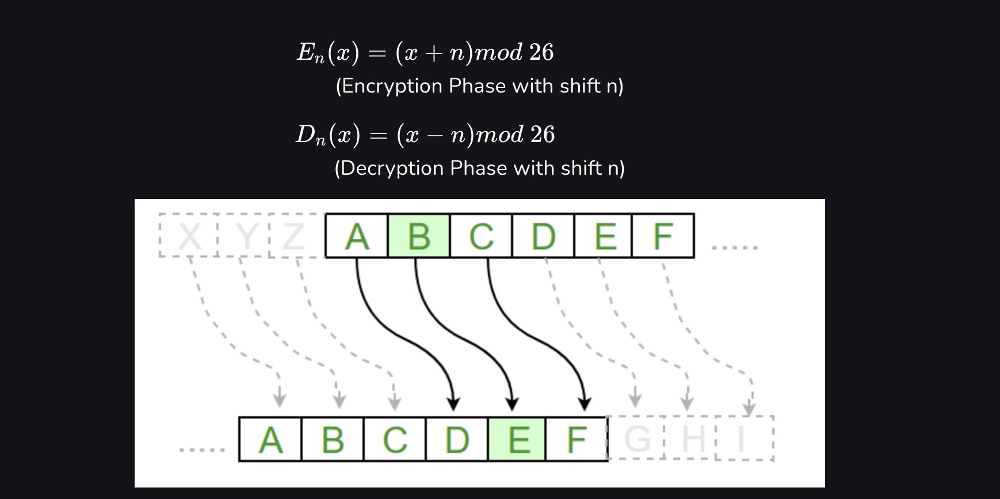
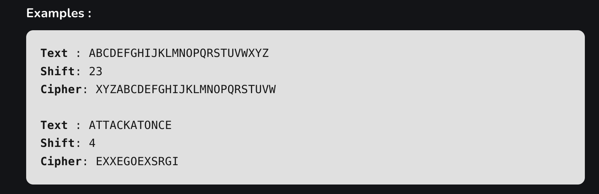

# 📘 Day 1: Caesar Cipher

## 🔐 What is Caesar Cipher Technique?

- 🏛️ The **Caesar Cipher** is one of the **earliest and simplest encryption techniques**, named after **Julius Caesar**, who used it to send secret messages to his allies.
- 🔁 It works by **shifting letters** in plaintext by a fixed number of positions, known as the **"Shift"** or **"Key"**.
- 🔡 Each letter in the text is replaced by another letter a fixed number of steps down the alphabet.  
  👉 *Example*: with a shift of 1: `A → B`, `C → D`, ..., `Z → A`.

---

## 📐 Cryptography Algorithm for Caesar Cipher

- To encrypt a text, you need an **integer value (shift)**, which determines how many positions each character is shifted.
- The Caesar Cipher can be mathematically represented using **modular arithmetic**:
  - Convert each character to a number: `A = 0`, `B = 1`, ..., `Z = 25`
  - Use the formula:  
    ```
    Encrypted = (original_letter_position + shift) % 26
    ```
- The alphabet wraps around — so after `Z`, it loops back to `A`.

📊 **Example (Shift = 3)**:






## ✅ Advantages

- 🛠️ Easy to implement and understand — ideal for beginners.
- 🔄 Can be implemented physically (e.g. using a **Scytale** or rotating disk).
- 🔐 Requires only a small set of shared information (key).
- 🔧 Can be extended using multi-key or keyword-based shifts.

---

## ❌ Disadvantages

- 🔓 **Not secure** against modern decryption techniques.
- 🕵️ Vulnerable to **known-plaintext attacks**.
- 🧮 Only **26 possible keys** → easily brute-forced.
- 🧾 Not suitable for encrypting long or important messages.
- 🚫 Lacks core security principles: **confidentiality**, **integrity**, and **authenticity**.

---

## 🧩 Features of Caesar Cipher

1. 🧬 **Substitution cipher** – each letter is replaced by another.
2. 🔑 **Fixed key** – the shift value is shared between sender and receiver.
3. 🔁 **Symmetric encryption** – same key is used for both encryption and decryption.
4. 🎯 **Limited keyspace** – only 25 possible shifts.
5. 🔓 **Brute-force vulnerable** – easily cracked.
6. 📏 **Simple implementation** – only basic arithmetic needed.

---

## 📏 Rules for Caesar Cipher

1. Choose a shift value (1–25).
2. Write down the alphabet `A → Z`.
3. Shift each letter by the shift value.
4. Replace each plaintext character using the shifted alphabet.  
   👉 *Example*: "hello" with shift 3 → `"khoor"`
5. Decryption reverses the process using the same shift.

---

## 🧮 Algorithm for Caesar Cipher

### **Input:**

- Plaintext message
- A shift value (1–25)

### **Steps:**

1. Create the standard alphabet.
2. Create the shifted alphabet using the shift value.
3. Replace each character in the message using the shifted alphabet.
4. To decrypt: apply the same shift in reverse.

### **Example (Shift = 3):**
Original:  A B C D E F G H I J K L M N O P Q R S T U V W X Y Z
Shifted:  D E F G H I J K L M N O P Q R S T U V W X Y Z A B C

## 🧠 Procedure & Complexity

- Traverse the input text character-by-character.
- Apply the transformation based on encryption or decryption.
- Return the result.

**Time Complexity:** `O(N)`  
**Auxiliary Space:** `O(N)`  
(*N = length of text*)

---

## 🧾 Conclusion

The Caesar Cipher, though simple, is an important milestone in the history of cryptography. It introduces fundamental concepts like key-based encryption and substitution, paving the way for more advanced techniques.

While it's **not secure** by modern standards, understanding it helps build a solid foundation in **cryptographic thinking** — from **classical ciphers** to today's **digital encryption algorithms**.